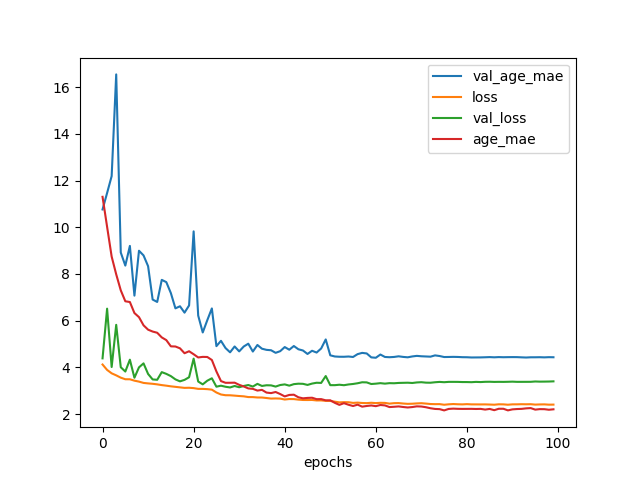

# Age Estimation
This sub-project focuses on improving the accuracy of age estimation.


## Dataset Preparation

### APPA-REAL Dataset
Follow the instructions [here](../appa-real/README.md) to download and extract the dataset.

### UTK Face Dataset
Firstly, download images from [the website of the UTKFace dataset](https://susanqq.github.io/UTKFace/).
`part1.tar.gz`, `part2.tar.gz`, and `part3.tar.gz` can be downloaded from `In-the-wild Faces` in Datasets section.
Then, extract the archives:

```sh
tar zxf part1.tar.gz
tar zxf part2.tar.gz
tar zxf part3.tar.gz
```

Finally, run the following script to create the training data:

```
python3 utkface/create_db_utkface_with_margin.py --input [PATH_TO_DATASET_DIR] --output [OUTPUT_DIR]
```

`[PATH_TO_DATASET_DIR]` should be a directory that includes `part1`, `part2`, and `part3` directories.
The cropped face images with margin will be created in `[OUTPUT_DIR]`.


### Training

```bash
python3 train.py --appa_dir [PATH_to_appa-real-release] --utk_dir [PATH_TO_UTK_CROPPED_FACE_DIR] --nb_epochs 100
```

Options:

```bash
usage: train.py [-h] --appa_dir APPA_DIR [--utk_dir UTK_DIR]
                [--output_dir OUTPUT_DIR] [--batch_size BATCH_SIZE]
                [--nb_epochs NB_EPOCHS] [--lr LR] [--model_name MODEL_NAME]

This script trains the CNN model for age estimation.

optional arguments:
  -h, --help            show this help message and exit
  --appa_dir APPA_DIR   path to the APPA-REAL dataset (default: None)
  --utk_dir UTK_DIR     path to the UTK face dataset (default: None)
  --output_dir OUTPUT_DIR
                        checkpoint dir (default: checkpoints)
  --batch_size BATCH_SIZE
                        batch size (default: 32)
  --nb_epochs NB_EPOCHS
                        number of epochs (default: 30)
  --lr LR               learning rate (default: 0.1)
  --model_name MODEL_NAME
                        model name: 'ResNet50' or 'InceptionResNetV2'
                        (default: ResNet50)
```

### Result

Currently the best MAE (against apparent age) is 5.250.



weights: https://github.com/yu4u/age-gender-estimation/releases/download/v0.5/age_only_weights.029-4.027-5.250.hdf5


### Demo
Run the demo script (requires web cam).
You can use `--image_dir [IMAGE_DIR]` option to use images in the `[IMAGE_DIR]` directory instead.

```sh
python3 demo.py
```

The pretrained model for TensorFlow backend will be automatically downloaded to the `pretrained_models` directory.

```bash
optional arguments:
  -h, --help            show this help message and exit
  --model_name MODEL_NAME
                        model name: 'ResNet50' or 'InceptionResNetV2'
                        (default: ResNet50)
  --weight_file WEIGHT_FILE
                        path to weight file (e.g.
                        age_only_weights.029-4.027-5.250.hdf5) (default: None)
  --margin MARGIN       margin around detected face for age-gender estimation
                        (default: 0.4)
  --image_dir IMAGE_DIR
                        target image directory; if set, images in image_dir
                        are used instead of webcam (default: None)
```